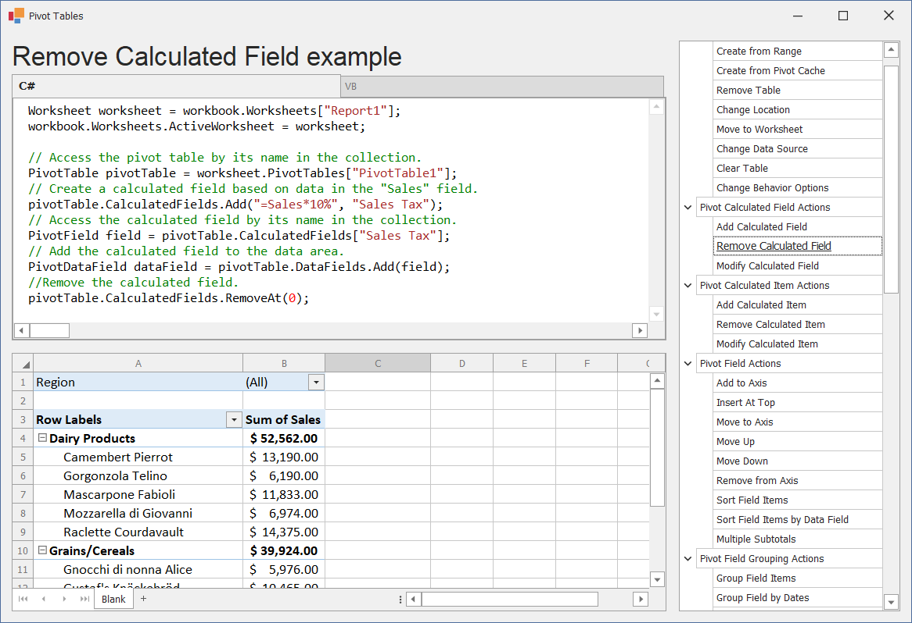

<!-- default badges list -->

<!-- default badges end -->
# WinForms Spreadsheet Pivot Table API - Manage Pivot Tables in Code

This example demonstrates how to use the SpreadsheetControl [Pivot Table API](https://docs.devexpress.com/WindowsForms/114928/controls-and-libraries/spreadsheet/pivot-tables/pivot-table-api) to create and modify pivot tables in code.

The application includes the [RichEditControl](https://docs.devexpress.com/WindowsForms/4946/controls-and-libraries/rich-text-editor) (at the top) used to display and edit the code and the [SpreadsheetControl](https://docs.devexpress.com/WindowsForms/DevExpress.XtraSpreadsheet.SpreadsheetControl) (at the bottom) which shows the result of code execution.

You can modify the code and watch the result. If an error occurs during compilation or execution, the code window background color turns to pink.

## Files to Review

* [CodeExamples](./CS/SpreadsheetPivotTableExamples/CodeExamples) (VB: [CodeExamples](./VB/SpreadsheetPivotTableExamples/CodeExamples))

## Documentation

* [Pivot Tables in Spreadsheet Documents](https://docs.devexpress.com/WindowsForms/114770/controls-and-libraries/spreadsheet/pivot-table-overview)
<!-- feedback -->
## Does this example address your development requirements/objectives?

 

(you will be redirected to DevExpress.com to submit your response)
<!-- feedback end -->
